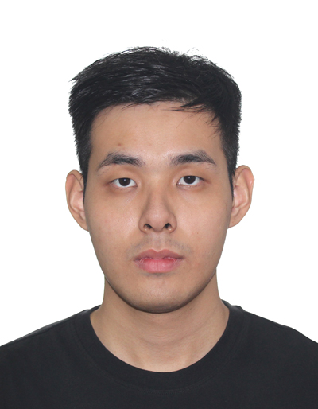

# About Us

We are a team based in the [School of Computing, National University of Singapore](http://www.comp.nus.edu.sg).

You can reach us at the email `seer[at]comp.nus.edu.sg`

## Project team

### Chong Wei Jun

[[github](https://github.com/dubbeyou)]

* Role: Code Quality + Testing
* Responsibilities:  Ensure adherence to coding standards and ensures testing is done properly.

### Jane Doe

[[github](http://github.com/johndoe)]
[[portfolio](team/johndoe.md)]

* Role: Team Lead
* Responsibilities: UI

### Koh Wei Long, Dylan

[[github](https://github.com/RaisinMoldyBread)]

* Role: Team Lead
* Responsibilities: Overall Project coordination

### Navid Chew

[[github](http://github.com/nvdchw)]

* Role: Documentation + Integration
* Responsibilities: Responsible for the quality of various project documents. In charge of versioning of the code, maintaining the code repository, integrating various parts of the software to create a whole.

### LI KEHAN

[[github](https://github.com/kehan-li2)]

* Role: Scheduling and tracking
* Responsibilities: In charge of defining, assigning and tracking project tasks.
